<div align="center">
  
  <h1>Intelligent Hotel Retention Agent 🏨💡</h1>
  <p><b>AI-Powered Customer Retention & Churn Prevention System</b></p>
</div>

---

## 📌 Introduction
The **Intelligent Hotel Retention Agent** is a comprehensive, AI-driven solution designed to predict customer churn, identify at-risk guests, and proactively offer personalized retention packages. 

By unifying **Machine Learning (ML)**, **Retrieval-Augmented Generation (RAG)**, and an autonomous **LangGraph Agent**, this platform empowers hotel administrators to make data-backed decisions instantly and retain valuable customers.

## 📸 System Interface (Demo)

### 1. Main Chat Interface


### 2. Agent Tool Usage & Retention Flow


### 3.human  approval 


### 4. send retention email


*(Note: The `demo/` folder contains screenshots of the working Streamlit UI and Admin flow.)*

---

## 🏗️ How It Works (Project Architecture)

Our system is composed of several advanced pipelines working in tandem:

### 1. The Machine Learning (ML) Pipeline 🧠
*   **Purpose:** Predicts whether a customer is likely to cancel their booking or stop using the hotel services (Churn).
*   **Workflow:**
    *   Ingests historical booking data and customer profiles.
    *   Trains a **Random Forest / XGBoost** model.
    *   Generates a lightweight `model.joblib` artifact used for real-time inference.
*   **Outcome:** Assigns a "Risk Score" (Low/Medium/High) to specific customers when queried by the Agent.

### 2. The RAG Pipeline (Retrieval-Augmented Generation) 📚
*   **Purpose:** Provides the LLM with context regarding the hotel's static retention policies, room upgrade guidelines, and discount tiers.
*   **Workflow:**
    *   Parses PDF documents (e.g., `Retention_Policies.pdf`).
    *   Generates embeddings using HuggingFace models.
    *   Stores embeddings in a local **ChromaDB** vector database.
*   **Outcome:** Allows the Agent to accurately quote hotel rules without generating hallucinations.

### 3. The Autonomous Agent Pipeline 🤖 (LangGraph)
*   **Purpose:** The central "brain" orchestrating the user's requests.
*   **Workflow:**
    *   Powered by **Llama3 (via Groq API)** for ultra-fast reasoning.
    *   Built using **LangGraph** to manage state and tool execution.
    *   Can trigger a suite of tools:
        *   📊 `get_customer_risk_score` (Queries the ML Model)
        *   🔍 `search_retention_policy` (Queries ChromaDB)
        *   🏨 `fetch_customer_booking` (Queries SQLite DB)
        *   👔 `request_manager_approval` (Human-in-the-loop pause)
        *   📧 `send_retention_email` (Takes action)

---

## 🛠️ Technology Stack

| Category | Technologies Used |
| :--- | :--- |
| **Frontend** | Streamlit (Custom styled UI) |
| **Backend API** | Flask |
| **AI / NLP** | LangChain, LangGraph, Groq API (Llama 3) |
| **Machine Learning** | Scikit-Learn, Pandas, Joblib |
| **Vector Database** | ChromaDB, HuggingFace Embeddings |
| **Relational DB** | SQLite (Synthetic data for demo purposes) |
| **CI/CD** | Jenkins, Docker, AWS S3, AWS ECR, AWS EC2 |

---

## 🚀 Professional CI/CD Pipeline (Stateless Architecture)

We employ a robust, **stateless** CI/CD architecture leveraging **Jenkins** and **AWS**, ensuring that the container remains lightweight, secure, and production-ready.

### 🔄 The Deployment Flow:
1.  **Code Push:** Developer pushes code to GitHub.
2.  **Webhook Trigger:** GitHub notifies Jenkins (running locally, exposed via ngrok).
3.  **Continuous Integration (Jenkins):**
    *   Installs dependencies and runs Python tests (`pytest`).
    *   **Trains the ML Model** dynamically and generates `model.joblib`.
    *   **Builds the Vector Store** locally using ChromaDB.
    *   **Uploads Artifacts:** Uploads the newly generated ML model and Vector DB to an **AWS S3 Bucket** (`hotel-retention-artifacts`).
4.  **Continuous Delivery (Docker & AWS):**
    *   Builds a lightweight Docker image (`python:3.10-slim`). The image *excludes* the large model and database files.
    *   Pushes the image to **AWS ECR** (Elastic Container Registry).
    *   SSH connects to an **AWS EC2** instance and pulls the latest container.

### 🐳 Container Startup (Runtime Hydration)
When the Docker container boots on the EC2 instance, the `start.sh` entry point script executes:
1.  **Downloads Artifacts:** Uses the AWS CLI to pull `model.joblib` and the ChromaDB index from S3.
2.  **Seeds Database:** Runs `seed_database.py` to generate a fresh, ephemeral SQLite database (`hotel.db`).
3.  **Launches Services:** Starts both the Flask backend API and Streamlit User Interface simultaneously.


### 🌊 CI/CD Flow Diagram 

```mermaid
flowchart TD
    %% Define Styles
    classDef dev fill:#3498db,stroke:#2980b9,stroke-width:2px,color:#fff
    classDef git fill:#2c3e50,stroke:#1a252f,stroke-width:2px,color:#fff
    classDef jenkins fill:#e74c3c,stroke:#c0392b,stroke-width:2px,color:#fff
    classDef aws fill:#f39c12,stroke:#d68910,stroke-width:2px,color:#fff
    classDef steps fill:#ecf0f1,stroke:#bdc3c7,stroke-width:1px,color:#2c3e50
    classDef ec2 fill:#27ae60,stroke:#2ecc71,stroke-width:2px,color:#fff

    %% Nodes
    Dev([👨‍💻 Developer]):::dev
    GitHub(fa:fa-github GitHub Repository):::git
    Jenkins{fa:fa-cogs Jenkins Pipeline}:::jenkins
    
    %% Jenkins Pipeline Steps
    subgraph JP [Jenkins Pipeline]
        direction TB
        S1[1. Install Dependencies]:::steps
        S2[2. Run Pytest]:::steps
        S3[3. Train ML Model]:::steps
        S4[4. Build ChromaDB]:::steps
        S5[5. Upload to AWS S3]:::steps
        S6[6. Build Docker Image]:::steps
        S7[7. Push to AWS ECR]:::steps
        S8[8. SSH Deploy]:::steps
        
        S1 --> S2 --> S3 --> S4 --> S5 --> S6 --> S7 --> S8
    end

    %% AWS Artifacts
    S3[(fa:fa-database AWS S3<br/>hotel-retention-artifacts)]:::aws
    ECR[fa:fa-box AWS ECR<br/>Docker Registry]:::aws

    %% Deployment Target
    subgraph AWS_EC2 [AWS EC2 Instance]
        direction TB
        EC2(fa:fa-server Docker Container Startup):::ec2
        D1[⬇️ Download model.joblib from S3]:::steps
        D2[⬇️ Download chroma_db from S3]:::steps
        D3[🌱 Seed SQLite Database]:::steps
        D4[🚀 Start Flask & Streamlit]:::steps
        
        EC2 --> D1 --> D2 --> D3 --> D4
    end

    %% Connections
    Dev -- Pushes Code --> GitHub
    GitHub -- Webhook Trigger --> Jenkins
    Jenkins --> JP
    
    S5 -. Uploads Artifacts .-> S3
    S7 -. Pushes Image .-> ECR
    
    S8 ==> |Triggers Deploy| AWS_EC2
    
    ECR -. Pulls Latest Image .-> AWS_EC2
    S3 -. Fetch on Startup .-> D1
```



**Why this matters?** 
*This approach decouples application code from data artifacts. It guarantees clean, reproducible deployments, reduces Docker image bloat, and allows us to retrain models without restarting the application infrastructure.*

---

## 💻 Running Locally

### 1. Clone & Set Up
```bash
git clone https://github.com/your-username/intelligent-hotel-retention-agent.git
cd intelligent-hotel-retention-agent
python3 -m venv venv
source venv/bin/activate  # On Windows: venv\Scripts\activate
pip install -r requirements.txt
```

### 2. Environment Variables
Copy `.env.example` to `.env` and fill in your keys:
```env
GROQ_API_KEY=your_key
TAVILY_API_KEY=your_key
```

### 3. Start the Application
Run the startup script to initialize everything:
```bash
# On Linux / Mac
chmod +x start.sh
./start.sh

# Or manually run in two separate terminal windows:
python main.py
streamlit run app.py
```

*Open your browser to `http://localhost:8501` to use the Agent.*